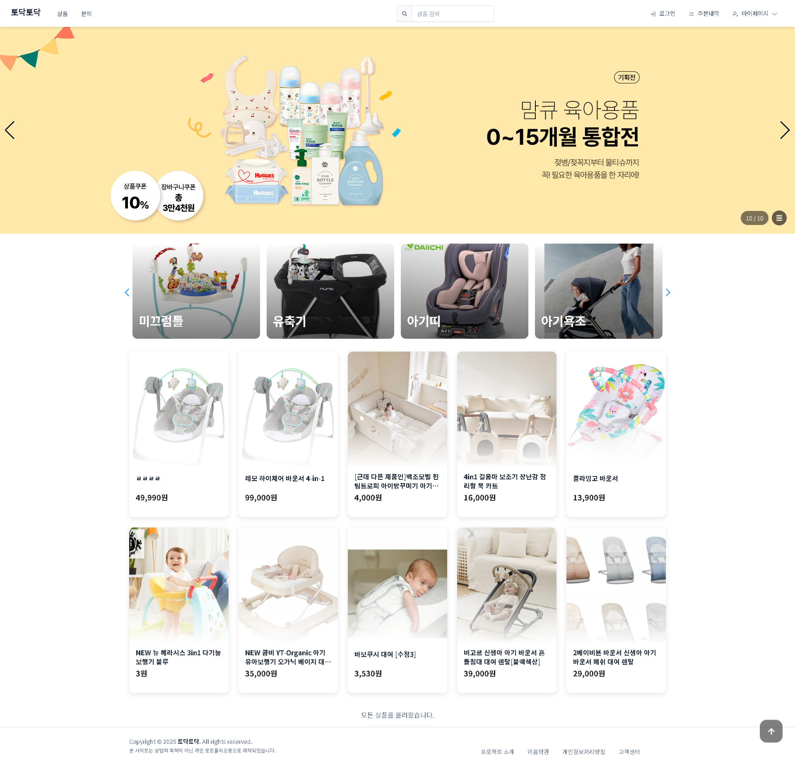

# 토닥토닥 (Todak-Todak) 🍼

[//]: # ([![GitHub License]&#40;https://img.shields.io/github/license/minki-jeon/todak-todak&#41;]&#40;https://github.com/minki-jeon/todak-todak/blob/main/LICENSE.md&#41;)

[//]: # ([![GitHub stars]&#40;https://img.shields.io/github/stars/minki-jeon/todak-todak&#41;]&#40;https://github.com/minki-jeon/todak-todak/stargazers&#41;)

[//]: # ([![GitHub forks]&#40;https://img.shields.io/github/forks/minki-jeon/todak-todak&#41;]&#40;https://github.com/minki-jeon/todak-todak/network/members&#41;)

[//]: # ([![GitHub issues]&#40;https://img.shields.io/github/issues/minki-jeon/todak-todak&#41;]&#40;https://github.com/minki-jeon/todak-todak/issues&#41;)


[//]: # (![Bootstrap]&#40;https://img.shields.io/badge/Bootstrap-5-purple&#41;)

**육아용품 대여 서비스 플랫폼**

사용자가 다양한 육아용품을 쉽고 편리하게 대여·반납할 수 있는 환경을 제공하는 웹 플랫폼입니다.

## 🌟 주요 기능

### 👥 사용자 기능

- **회원 관리**: 회원가입, 로그인, 비밀번호 찾기
- **상품 검색 및 조회**: 카테고리별 상품 검색, 상세 정보 조회
- **대여 서비스**: 상품 대여 신청, 대여 현황 조회
- **주문 관리**: 주문 내역 조회, 배송 추적
- **결제**: 카카오페이 연동 결제 시스템
- **고객 지원**: 1:1 문의 게시판

### 🔧 관리자 기능

- **회원 관리**: 회원 정보 조회 및 관리
- **상품 관리**: 상품 등록, 수정, 삭제
- **주문 관리**: 주문 상태 변경, 배송 관리
- **대여 관리**: 대여 현황 모니터링
- **콘텐츠 관리**: 배너, 카테고리 관리
- **고객 지원**: 문의 답변 관리

## 🛠️ 기술 스택

### Backend

- **Framework**: Spring Boot 3.x
- **Security**: Spring Security + JWT
- **Database**: MySQL (JPA/Hibernate)
- **File Storage**: AWS S3
- **Payment**: 카카오페이 API
- **Documentation**: Spring REST Docs

### Frontend

- **Framework**: React 19 + Vite
- **Template**: Bootstrap Astro E-commerce Template 기반
- **Styling**: Bootstrap 5 + React Bootstrap + Custom SCSS
- **Routing**: React Router v7
- **HTTP Client**: Axios
- **UI Components**: React Icons, React Slick, Swiper
- **Notifications**: React Toastify

### Infrastructure

- **Cloud**: AWS (S3, EC2)
- **SSL**: HTTPS 지원
- **Build Tool**: Maven (Backend), Vite (Frontend)

## 📁 프로젝트 구조

```
todak-todak/
├── backend/                 # Spring Boot 백엔드
│   ├── src/main/java/
│   │   └── com/example/backend/
│   │       ├── banner/      # 배너 관리
│   │       ├── category/    # 카테고리 관리
│   │       ├── common/      # 공통 상수 및 유틸리티
│   │       ├── config/      # 설정 클래스 (Security, AWS S3 등)
│   │       ├── contact/     # 문의 게시판
│   │       ├── delivery/    # 배송 업체 관리
│   │       ├── main/        
│   │       ├── member/      # 회원 관리
│   │       ├── order/       # 주문 관리
│   │       ├── product/     # 상품 관리
│   │       ├── rental/      # 대여 관리
│   │       └── sale/        # 판매 관리
│   └── src/main/resources/
└── frontend/                # React + Vite 프론트엔드
    ├── src/
│   │   ├── App.jsx         # BrowserRouter
│   │   ├── ComingSoon.jsx  # 준비중 안내
│   │   ├── main.jsx        # 애플리케이션 엔트리 포인트
    │   ├── assets/         # Astro-Ecommerce
    │   ├── common/         # 공통 컴포넌트 (네비게이션, 인증 등)
    │   ├── feature/        # 기능별 컴포넌트
    │   ├── json/           # 주문 상태값
    │   ├── main/           # 메인 페이지
    │   └── css/            # 스타일시트
    └── public/             # 파비콘, 썸네일
```

## 🚀 시작하기

### 필요 조건

- Java 17+
- Node.js 18+
- MySQL 8.0+
- Maven 3.6+

### 설치 및 실행

1. **저장소 클론**
   ```bash
   git clone https://github.com/minki-jeon/todak-todak.git
   cd todak-todak
   ```

2. **Backend 설정**
   ```bash
   cd backend
   
   # application.properties 설정
   # - 데이터베이스 연결 정보
   # - AWS S3 설정
   # - 카카오페이 API 키
   # - JWT 키 설정
   
   # 실행
   ./mvnw spring-boot:run
   ```

3. **Frontend 설정**
   ```bash
   cd frontend
   npm install
   npm run dev
   ```

4. **접속**
    - Frontend: http://localhost:5173
    - Backend API: http://localhost:8080

## 🌐 배포

프로덕션 환경에서는 다음과 같이 설정됩니다:

- **도메인**: https://todak-todak.dev
- **SSL**: Let's Encrypt
- **CDN**: AWS CloudFront (이미지 배포)

## 🎨 디자인 및 템플릿

이 프로젝트는 **Bootstrap Astro E-commerce Template**을 기반으로 제작되었습니다.

### 템플릿 특징

- **Bootstrap 5** 기반의 현대적이고 반응형 디자인
- **E-commerce** 특화 UI/UX 컴포넌트
- **모바일 퍼스트** 접근 방식
- **접근성(Accessibility)** 고려한 사용자 친화적 인터페이스

### 커스터마이징

- 육아용품 대여 서비스에 맞는 컬러 스킴 적용
- 한국형 UI/UX에 맞춘 레이아웃 조정
- 카테고리별 아이콘 및 이미지 최적화
- 반응형 네비게이션 및 검색 기능 강화

### 주요 스타일 파일

- `astro-ecommerce.scss`: 메인 스타일시트 (템플릿 기반)
- `navbar.css`: 네비게이션 커스터마이징
- `main_banner.css`: 메인 배너 슬라이더 스타일
- `main_category.css`: 카테고리 카드 스타일
- `main_salelist.css`: 상품 목록 스타일

## 📸 스크린샷



### 메인 페이지

- 메인 배너 (Swiper 슬라이드)
- 카테고리 메뉴
- 무한 스크롤 상품 목록

### 주요 기능

- 상품 상세 페이지
- 대여 신청 및 결제
- 주문 내역 조회

## 📋 주요 기능 상세

## 🤝 기여자

| 개발자 | GitHub                                       | 담당 역할            |
|-----|----------------------------------------------|------------------|
| 전민기 | [@minki-jeon](https://github.com/minki-jeon) | Backend, DevOps  |
| 라건국 | [@kk250639](https://github.com/kk250639)     | Frontend, UI/UX  |
| 박지훈 | [@jihoon0213](https://github.com/jihoon0213) | Frontend, API 연동 |

### 인증 시스템

- JWT 기반 토큰 인증
- Spring Security를 활용한 권한 관리

### 결제 시스템

- 카카오페이 API 연동
- 실시간 결제 상태 확인
- 결제 실패/취소 처리

### 파일 관리

- AWS S3를 활용한 이미지 업로드

### 반응형 디자인

- Bootstrap 5 기반 모바일 친화적 UI
- 다양한 디바이스 지원
- 접근성 고려한 UX

## 📝 라이선스

이 프로젝트는 [MIT License](LICENSE.md)에 따라 라이선스가 부여됩니다.

## 📞 문의

프로젝트에 대한 문의사항이나 버그 리포트는 [Issues](https://github.com/minki-jeon/todak-todak/issues)에 등록해주세요.

---

**⚠️ 주의사항**: 본 프로젝트는 포트폴리오 목적으로 제작되었으며, 상업적 용도로 사용되지 않습니다.